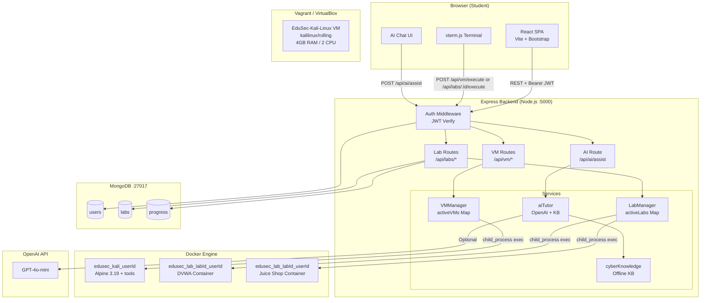

# PROJECT_MASTER_CONTEXT.md
> **Single Source of Truth — EduSec Labs**
> Version: 1.0.0 | Last Updated: June 2026 | Status: Active Development

---

## ⚠️ INSTRUCTIONS FOR FUTURE AI MODELS

**Read this entire file before making any changes to the codebase.**

1. **Do not redesign existing architecture** without explicit user justification and approval.
2. **Preserve backward compatibility** whenever possible — do not break existing API contracts.
3. **Build on current implementations** — extend `LabManager`, `VMManager`, `aiTutor`, and `cyberKnowledge` services rather than replacing them.
4. **Follow the roadmap priorities** defined in the [Future Features](#future-features) section.
5. **Suggest improvements incrementally** — propose small, mergeable changes over large rewrites.
6. **Maintain cybersecurity best practices** — this platform handles security education; all code must model secure patterns.
7. **Keep this documentation updated** — after any significant feature addition, update the relevant sections here.
8. **Do not hardcode secrets** — all sensitive values belong in `.env` files, never in source code.
9. **Container isolation is a first-class concern** — never allow cross-user container access.
10. **The in-memory `activeLabs` and `activeVMs` Maps are a known limitation** — any fix to persistence must not break the existing start/stop/status API signatures.

---

## Table of Contents

1. [Project Overview](#1-project-overview)
2. [Project Vision](#2-project-vision)
3. [Current Tech Stack](#3-current-tech-stack)
4. [System Architecture](#4-system-architecture)
5. [Folder Structure](#5-folder-structure)
6. [Database Design](#6-database-design)
7. [Authentication Flow](#7-authentication-flow)
8. [Current Features](#8-current-features)
9. [Lab System](#9-lab-system)
10. [Kali VM System](#10-kali-vm-system)
11. [AI Cyber Tutor](#11-ai-cyber-tutor)
12. [API Documentation](#12-api-documentation)
13. [Security Design](#13-security-design)
14. [Known Limitations & Technical Debt](#14-known-limitations--technical-debt)
15. [Future Features Roadmap](#15-future-features-roadmap)
16. [Deployment Strategy](#16-deployment-strategy)
17. [Coding Standards](#17-coding-standards)
18. [Contribution Guidelines](#18-contribution-guidelines)

---

## 1. Project Overview

### What is EduSec Labs?

EduSec Labs is an **AI-powered, browser-based cybersecurity learning platform** that provides students with hands-on, interactive security training inside real Docker-based vulnerable lab environments. It combines:

- **Real vulnerable applications** (DVWA, OWASP Juice Shop) running in isolated Docker containers
- **An Alpine-based "Kali-lite" VM** provisioned with penetration testing tools (nmap, gobuster, hydra, john, sqlmap, etc.) running inside Docker
- **An interactive terminal** (xterm.js) that executes commands directly inside containers
- **An AI Cyber Tutor** powered by OpenAI GPT-4o-mini with an offline keyword-matched knowledge base fallback
- **Progress tracking and a badge/achievement system** to reward learning milestones

### The Problem It Solves

| Problem | EduSec Labs Solution |
|---|---|
| Setting up pen-testing environments is complex and error-prone | One-click Docker container launch from a browser |
| Traditional security courses are passive (video-only) | Live, interactive terminal inside real vulnerable apps |
| Expensive commercial platforms (HTB, THM subscriptions) | Open-source, self-hostable, free for learners |
| No AI guidance during hands-on labs | Context-aware AI Tutor that knows which lab is active |
| Isolated environments shared across users | Per-user named containers with dedicated port allocation |

### Target Users

- **Security students** (university, bootcamp, self-taught) learning ethical hacking fundamentals
- **CTF beginners** building skills in a safe, legal environment
- **Security instructors** who need a platform to assign structured labs
- **Junior security engineers** upskilling in penetration testing and blue-team tools

### Key Differentiators

1. **Zero local setup** — students access full pen-test environments from a browser
2. **Dual-mode AI tutor** — works with OpenAI API *or* fully offline via curated knowledge base
3. **Real tool provisioning** — the VM container gets nmap, gobuster, hydra, john, sqlmap, rockyou wordlist installed at startup
4. **Self-hostable** — runs on any machine with Docker Desktop; no cloud dependency
5. **Unified platform** — lab management, VM control, AI guidance, and progress tracking in one UI

---

## 2. Project Vision

### Long-Term Vision

Transform EduSec Labs into an **enterprise-grade, open-source cyber range platform** comparable to Hack The Box and TryHackMe, with:

- Multi-tenant architecture supporting organizations and universities
- Full CTF engine with dynamic flags, scoring, and team competitions
- Blue Team labs (SIEM, Wazuh, ELK Stack, Suricata)
- AI Tutor V2 with memory, RAG, and multiple teaching personas (Red Team, Blue Team, SOC Analyst, Interview Coach)
- Professional pentest PDF report generation
- Kubernetes-native deployment for horizontal scaling
- Instructor dashboard for course management and student analytics

### Open-Source Goals

- MIT Licensed — free for individuals and educational institutions
- Modular architecture so institutions can plug in their own lab images
- Community-contributed lab scenarios and CTF challenges
- Docker Hub repository for pre-built vulnerable lab images

### Educational Impact

- Make enterprise-level security training accessible to students worldwide
- Bridge the gap between theoretical security knowledge and hands-on practice
- Prepare students for real-world security roles and certifications (CEH, OSCP, CompTIA Security+)

---

## 3. Current Tech Stack

### Frontend

| Technology | Version | Purpose |
|---|---|---|
| React.js | 18.2.0 | Component-based UI framework |
| Vite | 4.4.5 | Build tool and dev server |
| Bootstrap | 5.3.0 | CSS framework for responsive layout |
| xterm.js | 5.3.0 | Browser-based terminal emulator |
| xterm-addon-fit | 0.8.0 | Terminal auto-resize to container |
| React Router DOM | 6.15.0 | Client-side routing |
| Axios | 1.5.0 | HTTP client for API calls |

### Backend

| Technology | Version | Purpose |
|---|---|---|
| Node.js | 18.x | JavaScript runtime |
| Express.js | 4.18.2 | Web application framework |
| bcryptjs | 2.4.3 | Password hashing (salt rounds: 10) |
| jsonwebtoken | 9.0.2 | JWT generation and verification |
| cors | 2.8.5 | Cross-Origin Resource Sharing |
| dotenv | 16.3.1 | Environment variable management |
| express-validator | 7.0.1 | Input validation middleware |
| openai | 4.56.0 | OpenAI API client |
| mongoose | 7.5.0 | MongoDB ODM |
| axios | 1.5.0 | Internal HTTP requests |
| nodemon | 3.0.1 | Dev auto-restart |

### Database

| Technology | Purpose |
|---|---|
| MongoDB | Primary NoSQL database |
| Mongoose | Schema modeling, validation, query API |

**Connection string:** `mongodb://localhost:27017/edusec-labs` (configurable via `MONGODB_URI` env var)

### Authentication

- **JWT (JSON Web Tokens)** — stateless auth, 24-hour expiry
- **bcryptjs** — password hashing with salt rounds = 10
- **Bearer token** in `Authorization` header

### Infrastructure

| Component | Technology | Details |
|---|---|---|
| Vulnerable Labs | Docker | Named containers per user+lab |
| Kali-lite VM | Docker (Alpine 3.19) | Auto-provisioned with pen-test tools |
| Kali Full VM | Vagrant + VirtualBox | `kalilinux/rolling` box, 4GB RAM, 2 CPU |
| Port Management | In-memory Map | Base port 8082 (labs), 22220 (VMs) |
| Static Serving | Express | `../frontend/dist` in production |

### AI

| Component | Details |
|---|---|
| Primary Model | OpenAI GPT-4o-mini (configurable via `OPENAI_MODEL` env var) |
| Offline Fallback | Keyword-matched knowledge base (`cyberKnowledge.js`) — 4 topics |
| KB Topics | Web Recon, DVWA SQLi, OWASP Juice Shop, Password Cracking |
| System Prompt | Lab-scoped, ethics-enforcing, mitigation-paired |

---

## 4. System Architecture

### Architecture Explanation

EduSec Labs follows a **monolithic-first, service-oriented** architecture. The single Express server handles authentication, lab lifecycle management, VM management, and AI assistance. Services are decoupled into separate modules (`LabManager`, `VMManager`, `aiTutor`, `cyberKnowledge`) that can be extracted into microservices in a future Kubernetes deployment.

The frontend is a React SPA served either by Vite (dev) or Express static middleware (production). All API communication is via REST over HTTP with JWT authentication.

Docker containers are launched **from within the Node.js process** using Node's `child_process.exec/execFile`, targeting the host's Docker socket. In the Dockerized production deployment, the Docker CLI is installed inside the app container and the host socket is mounted as a volume.

### Architecture Diagram



### Data Flow — Lab Execution

```
Student types command in xterm.js
    → POST /api/labs/:id/execute {command}
    → JWT Auth Middleware verifies Bearer token
    → LabManager.executeCommand({labId, userId, command})
    → docker exec edusec_lab_{labId}_{userId} /bin/sh -c "{command}"
    → stdout/stderr captured and returned as {success, output}
    → xterm.js renders output
```

### Data Flow — AI Tutor

```
Student sends message
    → POST /api/ai/assist {message, labId, context}
    → aiTutor.generateTutorResponse()
    → cyberKnowledge.retrieveRelevant() [keyword matching]
    → IF OPENAI_API_KEY configured:
        → OpenAI chat.completions.create() with system prompt + KB context
    → ELSE: offline KB response
    → {response, usedModel, usedKB} returned to UI
```

---

## 5. Folder Structure

```
edusec-labs/                          # Project root
├── Dockerfile                        # Multi-stage: frontend build + backend serve
├── docker-compose.prod.yml           # Production compose
├── package.json                      # Root workspace scripts
├── setup.sh                          # One-shot local setup script
├── README.md
├── PROJECT_MASTER_CONTEXT.md         # ← This file
│
├── frontend/                         # React + Vite SPA
│   ├── index.html                    # Vite entry point
│   ├── vite.config.js                # Vite config (proxy: /api → :5000)
│   ├── package.json
│   ├── public/                       # Static assets
│   └── src/
│       ├── main.jsx                  # ReactDOM.createRoot()
│       ├── App.jsx                   # Router + Layout + Context Providers
│       ├── App.css                   # Global styles (19KB — custom dark theme)
│       ├── contexts/
│       │   ├── AuthContext.jsx       # JWT storage, user state, login/logout
│       │   └── NotificationContext.jsx  # Toast notification system
│       └── components/
│           ├── Home.jsx              # Landing page
│           ├── Login.jsx             # Login form + JWT flow
│           ├── Register.jsx          # Registration form
│           ├── Navbar.jsx            # Navigation bar
│           ├── Footer.jsx            # Footer component
│           ├── ProtectedRoute.jsx    # Auth guard wrapper
│           ├── Dashboard.jsx         # User stats, progress, badges
│           ├── Labs.jsx              # Lab catalog, start/stop controls
│           ├── LabDetails.jsx        # Individual lab detail view
│           ├── LabTerminal.jsx       # xterm.js terminal for lab containers
│           ├── LabGuides.js          # Static lab walkthrough content
│           ├── LabViewer.jsx         # Lab iframe/URL viewer
│           ├── VMInterface.jsx       # Kali VM control + xterm.js terminal
│           └── AIAssistant.jsx       # Chat UI for AI Cyber Tutor
│
├── backend/                          # Node.js + Express API
│   ├── server.js                     # Main entry: all routes, middleware, DB connect
│   ├── package.json
│   ├── setup.js                      # DB seed helper
│   ├── .env                          # Environment variables (not committed)
│   ├── models/
│   │   ├── User.js                   # User schema
│   │   ├── Lab.js                    # Lab definition schema
│   │   └── Progress.js               # User-lab progress schema
│   ├── services/
│   │   ├── labManager.js             # Docker container lifecycle for labs
│   │   ├── vmManager.js              # Docker container lifecycle for Kali VM
│   │   ├── aiTutor.js                # OpenAI + offline KB AI tutor
│   │   └── cyberKnowledge.js         # Offline keyword-matched KB (4 topics)
│   └── scripts/
│       ├── initLabs.js               # Seeds labs collection in MongoDB
│       └── apt_wrapper.sh            # apt→apk shim copied into Alpine VM container
│
├── docker-labs/
│   └── dvwa/                         # DVWA lab Docker config
│
├── vagrant/
│   └── Vagrantfile                   # Full Kali Linux VM (kalilinux/rolling)
│                                     # 4GB RAM, 2 CPU, ports 80/22/8080 forwarded
│
└── data/                             # Persistent data directory
```

### Planned Future Additions

```
backend/
├── routes/                           # [PLANNED] Separate route files per domain
│   ├── auth.routes.js
│   ├── labs.routes.js
│   ├── vm.routes.js
│   ├── ai.routes.js
│   ├── ctf.routes.js                 # [FUTURE] CTF engine
│   └── reports.routes.js             # [FUTURE] Pentest reports
├── middleware/
│   ├── auth.middleware.js            # [PLANNED] Extracted from server.js
│   ├── rateLimiter.js                # [FUTURE] express-rate-limit
│   └── rbac.js                       # [FUTURE] Role-based access control
├── models/
│   ├── Challenge.js                  # [FUTURE] CTF challenges
│   ├── Submission.js                 # [FUTURE] CTF flag submissions
│   ├── Team.js                       # [FUTURE] CTF teams
│   ├── LabInstance.js                # [FUTURE] Persistent container state
│   ├── AuditLog.js                   # [FUTURE] Security audit trail
│   └── Report.js                     # [FUTURE] Pentest reports
└── services/
    ├── ctfEngine.js                  # [FUTURE] Dynamic flag generation + validation
    ├── reportGenerator.js            # [FUTURE] PDF generation (Puppeteer/PDFKit)
    └── gamification.js               # [FUTURE] XP, ranks, skill trees

frontend/src/
├── pages/                            # [PLANNED] Route-level components
├── hooks/                            # [PLANNED] Custom React hooks
│   ├── useAuth.js
│   ├── useLabTerminal.js
│   └── useNotification.js
└── services/                         # [PLANNED] API call abstractions
    └── api.js
```

---

## 6. Database Design

### MongoDB Database: `edusec-labs`

---

#### Collection: `users`

**Purpose:** Stores registered student accounts with auth credentials and gamification state.

**Mongoose Schema** (`backend/models/User.js`):

```javascript
{
  username:  { type: String, required: true, unique: true },
  email:     { type: String, required: true, unique: true },
  password:  { type: String, required: true },     // bcrypt hash, saltRounds=10
  level:     { type: String, default: 'beginner' }, // 'beginner'|'intermediate'|'advanced'
  badges:    [String],                              // e.g. ['first-lab', 'sql-master']
  createdAt: { type: Date,   default: Date.now }
}
```

**Planned Extensions:**
```javascript
{
  // Gamification [FUTURE]
  xp:           { type: Number, default: 0 },
  rank:         { type: String, default: 'Script Kiddie' },
  streak:       { type: Number, default: 0 },
  lastActive:   { type: Date },
  skillTree:    { type: Map, of: Number },          // skill → level

  // Security [FUTURE]
  mfaEnabled:   { type: Boolean, default: false },
  mfaSecret:    { type: String },
  role:         { type: String, enum: ['student','instructor','admin'], default: 'student' },
  loginAttempts:{ type: Number, default: 0 },
  lockedUntil:  { type: Date }
}
```

**Relationships:**
- `users._id` → referenced by `progress.userId`
- `users._id` → used as key in `LabManager.activeLabs` and `VMManager.activeVMs`

---

#### Collection: `labs`

**Purpose:** Defines available lab environments — their Docker images, difficulty, and metadata.

**Mongoose Schema** (`backend/models/Lab.js`):

```javascript
{
  name:        { type: String, required: true },
  description: { type: String, required: true },
  difficulty:  { type: String, enum: ['easy','medium','hard'], required: true },
  category:    { type: String, required: true },    // e.g. 'Web Application', 'Network'
  dockerImage: { type: String },                    // e.g. 'vulnerables/web-dvwa'
  port:        { type: Number },                    // internal container port
  isActive:    { type: Boolean, default: false },
  createdAt:   { type: Date, default: Date.now }
}
```

**Seeded Labs** (via `backend/scripts/initLabs.js`):
- DVWA — `vulnerables/web-dvwa`, internal port 80, difficulty: easy
- OWASP Juice Shop — `bkimminich/juice-shop`, internal port 3000, difficulty: medium

**Planned Extensions:**
```javascript
{
  tags:          [String],                          // ['sqli','xss','owasp']
  points:        { type: Number, default: 100 },   // CTF point value
  flags:         [{ name: String, value: String }],// [FUTURE] CTF flags
  writeupUrl:    { type: String },
  estimatedTime: { type: Number },                  // minutes
  prerequisites: [{ type: ObjectId, ref: 'Lab' }]
}
```

**Relationships:**
- `labs._id` → referenced by `progress.labId`
- `labs.dockerImage` → used by `LabManager.startLabContainer()`

---

#### Collection: `progress`

**Purpose:** Tracks each user's progress for each lab.

**Mongoose Schema** (`backend/models/Progress.js`):

```javascript
{
  userId:      { type: ObjectId, ref: 'User', required: true },
  labId:       { type: ObjectId, ref: 'Lab',  required: true },
  status:      { type: String, enum: ['not_started','in_progress','completed'], default: 'not_started' },
  startedAt:   { type: Date },
  completedAt: { type: Date },
  score:       { type: Number, default: 0 }
}
```

**Planned Extensions:**
```javascript
{
  attempts:        { type: Number, default: 0 },
  hintsUsed:       { type: Number, default: 0 },    // [FUTURE] CTF hint tracking
  flagsSubmitted:  [{ flag: String, correct: Boolean, submittedAt: Date }],
  terminalHistory: [String],                         // [FUTURE] command audit
  timeSpent:       { type: Number }                  // seconds
}
```

**Indexes:** Compound index on `{userId, labId}` for O(1) lookups.

---

#### Planned Collections

**`labinstances`** — Persist container state across server restarts:
```javascript
{
  userId:        ObjectId,
  labId:         ObjectId,
  containerName: String,
  hostPort:      Number,
  internalPort:  Number,
  status:        String,  // 'running'|'stopped'|'paused'
  startedAt:     Date,
  lastPingedAt:  Date,
  resourceLimits:{ cpu: String, memory: String }
}
```

**`ctfchallenges`** — CTF challenge definitions:
```javascript
{
  title:       String,
  description: String,
  category:    String,    // 'web','crypto','forensics','pwn','misc'
  difficulty:  String,
  points:      Number,
  flagSeed:    String,    // base for dynamic flag generation (HMAC)
  hints:       [{ text: String, cost: Number }],
  files:       [String],
  isActive:    Boolean
}
```

**`ctfsubmissions`** — Flag submission records:
```javascript
{
  userId:      ObjectId,
  challengeId: ObjectId,
  teamId:      ObjectId,
  flag:        String,
  isCorrect:   Boolean,
  points:      Number,
  submittedAt: Date,
  ipAddress:   String     // anti-cheat
}
```

**`auditlogs`** — Security audit trail:
```javascript
{
  userId:    ObjectId,
  action:    String,      // 'login'|'lab_start'|'command_exec'|'flag_submit'
  resource:  String,
  details:   Mixed,
  ipAddress: String,
  userAgent: String,
  timestamp: Date
}
```

---

## 7. Authentication Flow

### Registration Flow

```
POST /api/auth/register
Body: { username, email, password }

1. Validate: username, email, password all present
2. Validate: email format (regex)
3. Validate: password >= 6 characters
4. Check: User.findOne({ $or: [{email}, {username}] }) — reject if exists
5. Hash: bcrypt.hash(password, saltRounds=10)
6. Create: new User({ username, email, password: hashedPassword })
7. Sign: JWT { userId: user._id } — expires 24h
8. Return: { token, user: { id, username, email, level } }
```

### Login Flow

```
POST /api/auth/login
Body: { email, password }

1. Validate: email and password present
2. Find: User.findOne({ email })  — reject if not found (generic message)
3. Compare: bcrypt.compare(password, user.password)  — reject if no match
4. Sign: JWT { userId: user._id } — expires 24h
5. Return: { token, user: { id, username, email, level, badges } }
```

### JWT Storage (Frontend)

```javascript
// AuthContext.jsx
localStorage.setItem('token', token);
localStorage.setItem('user', JSON.stringify(user));
```

### Protected Routes

```javascript
// Backend auth middleware
const token = req.header('Authorization')?.replace('Bearer ', '');
const decoded = jwt.verify(token, process.env.JWT_SECRET);
req.user = await User.findById(decoded.userId).select('-password');

// Frontend ProtectedRoute.jsx
if (!user) return <Navigate to="/login" replace />;
```

### Routes Requiring Authentication

All routes except `POST /api/auth/register`, `POST /api/auth/login`, and `POST /api/auth/reset-password`.

### Password Reset

`POST /api/auth/reset-password { email, newPassword }` — **No token required (current limitation)**. This is a known security gap — see [Known Limitations](#14-known-limitations--technical-debt).

### Logout

```javascript
// AuthContext.jsx — client-side only
localStorage.removeItem('token');
localStorage.removeItem('user');
// No server-side token invalidation (stateless JWT)
```

---

## 8. Current Features

### Feature 1: User Authentication
- **Purpose:** Secure account creation, login, and session management
- **Implementation:** Express routes + bcryptjs + JWT + `AuthContext.jsx`
- **Status:** ✅ Implemented — registration, login, reset-password, protected routes

### Feature 2: Dashboard
- **Purpose:** Overview of user progress, stats, and recent activity
- **Implementation:** `Dashboard.jsx` reads progress from backend via JWT-authenticated requests
- **Status:** ✅ Implemented — shows lab progress counts and badge list

### Feature 3: Progress Tracking
- **Purpose:** Track which labs a user has started/completed and their score
- **Implementation:** `Progress` MongoDB collection; updated on `POST /api/labs/:id/start`; reconciled with live Docker state on `GET /api/labs`
- **Status:** ✅ Implemented — status reconciliation between DB and live containers prevents stale state

### Feature 4: Achievement / Badge System
- **Purpose:** Reward milestones to drive engagement
- **Implementation:** `badges: [String]` array on User model; `Dashboard.jsx` displays badge list
- **Status:** ⚠️ Partial — badge storage implemented, badge awarding logic not yet automated

### Feature 5: Docker Lab Management
- **Purpose:** Launch, stop, and interact with containerized vulnerable applications
- **Implementation:** `LabManager` service + `/api/labs/*` routes; per-user named containers `edusec_lab_{labId}_{userId}`; auto port allocation starting at 8082
- **Status:** ✅ Implemented — start, stop, status, execute-command all working

### Feature 6: Kali VM Management
- **Purpose:** Provide students with a browser-accessible pen-test toolset
- **Implementation:** `VMManager` service + `/api/vm/*` routes; Alpine 3.19 container named `edusec_kali_{userId}`; async tool provisioning (nmap, gobuster, hydra, john, sqlmap, rockyou.txt)
- **Status:** ✅ Implemented — full tool installation, command execution, cleanup timer (30-min inactivity)

### Feature 7: AI Cyber Tutor
- **Purpose:** Context-aware AI guide that explains concepts, suggests steps, enforces ethics
- **Implementation:** `aiTutor.js` + `cyberKnowledge.js` + `/api/ai/assist` route; dual-mode: OpenAI GPT-4o-mini (primary) + offline keyword KB (fallback)
- **Status:** ✅ Implemented — both online (OpenAI) and offline modes working

### Feature 8: Interactive Terminal (xterm.js)
- **Purpose:** Browser-based terminal for executing commands inside containers
- **Implementation:** `LabTerminal.jsx` (lab containers) and `VMInterface.jsx` (Kali VM); xterm.js with FitAddon; polls `POST /api/labs/:id/execute` or `POST /api/vm/execute`
- **Status:** ✅ Implemented — full command input/output cycle working

### Feature 9: Notifications
- **Purpose:** Toast-style feedback for user actions (lab start, errors, etc.)
- **Implementation:** `NotificationContext.jsx` — context provider with toast state management (7.6KB implementation)
- **Status:** ✅ Implemented

### Feature 10: Lab Guides
- **Purpose:** Step-by-step walkthrough content for each lab
- **Implementation:** `LabGuides.js` — static JavaScript object containing lab-specific guidance text
- **Status:** ✅ Implemented — static content, not yet AI-generated

---

## 9. Lab System

### Supported Labs

| Lab | Docker Image | Internal Port | Difficulty | Category |
|---|---|---|---|---|
| DVWA | `vulnerables/web-dvwa` | 80 | Easy | Web Application Security |
| OWASP Juice Shop | `bkimminich/juice-shop` | 3000 | Medium | Web Application Security |

### Container Naming Convention

```
edusec_lab_{labId}_{userId}
```
Non-alphanumeric characters replaced with `_`. This ensures unique containers per user-lab pair.

### Port Allocation

- Base HTTP port: **8082**
- Random offset: `Math.random() * 1000` to avoid sequential prediction
- Collision check: scans `activeLabs.values()` before assigning
- Access URL returned to client: `http://localhost:{hostPort}`

### Internal Port Inference

```javascript
_inferInternalPort(dockerImage) {
  if (image.includes('juice-shop')) return 3000;
  if (image.includes('dvwa'))       return 80;
  return 80; // default fallback
}
```

### Lab Lifecycle

#### Start Lab (`POST /api/labs/:id/start`)
1. Fetch `Lab` document from MongoDB
2. Create/update `Progress` record to `in_progress`
3. Call `LabManager.startLabContainer({ lab, userId })`
4. Check if container already in `activeLabs` Map — return existing if so
5. Infer internal port, find free host port
6. `docker image inspect` → `docker pull` if not local
7. `docker rm -f {containerName}` — remove stale container
8. `docker run -d --name {containerName} -p {hostPort}:{internalPort} {image}`
9. Store details in `activeLabs` Map
10. Return `{ accessUrl, hostPort, containerName, status }`

#### Stop Lab (`POST /api/labs/:id/stop`)
1. Look up `activeLabs` Map or reconstruct container name
2. `docker rm -f {containerName}`
3. Remove from `activeLabs` Map

#### Lab Status (`GET /api/labs/:id/status`)
1. Look up `activeLabs` Map
2. `docker inspect -f '{{.State.Running}}' {containerName}`
3. Return `{ ...details, status: 'running' | 'stopped' }`

#### Execute Command (`POST /api/labs/:id/execute`)
1. Verify container in `activeLabs` Map
2. `docker exec {containerName} /bin/sh -c "{command}"` via `execFile`
3. Return `{ success, output }` (stdout + stderr combined)

#### Lab Reset
- Currently: Stop + Start sequence
- Planned: `docker restart` or snapshot restoration

---

## 10. Kali VM System

### Current Architecture

The "Kali VM" is currently implemented as a **Docker container** running Alpine Linux 3.19 (not a full Vagrant VM in production). The Vagrant Vagrantfile exists for future full-VM deployment.

### Docker-Based Kali-lite

**Container:** `edusec_kali_{userId}`
**Base image:** `alpine:3.19`
**Provisioned tools (async, post-startup):**
- `bash`, `sudo`, `nmap`, `curl`, `hydra`, `john`, `python3`, `git`
- `gobuster` v3.6.0 (precompiled binary from GitHub releases)
- `sqlmap` (git clone from sqlmapproject/sqlmap)
- `apt` wrapper script (maps `apt`/`apt-get` → `apk`)
- `rockyou.txt` (10k-most-common from SecLists)

### VM Lifecycle

#### Start (`POST /api/vm/start`)
1. `VMManager._checkDockerConnection()` — fail fast if Docker not running
2. Check `activeVMs` Map — return existing if present
3. `docker rm -f edusec_kali_{userId}` — clean up stale
4. `docker pull alpine:3.19` if not cached
5. `docker run -d --init --name {containerName} alpine:3.19 sh -c "while true; do sleep 3600; done"`
6. Verify container running (2s wait + inspect check)
7. Async provision: install tools, clone sqlmap, setup gobuster, download wordlists
8. Return `{ id, status, containerName, sshPort, startedAt }`

#### Stop (`POST /api/vm/stop`)
1. Lookup `activeVMs` Map
2. `docker rm -f {containerName}`
3. Remove from `activeVMs` Map

#### Status (`GET /api/vm/status`)
1. Lookup `activeVMs` Map
2. If not found: inspect Docker for orphaned container (server restart recovery)
3. `docker inspect -f '{{.State.Running}}' {containerName}`
4. Return `{ ...vmDetails, status: 'running' | 'stopped' }`

#### Execute Command (`POST /api/vm/execute`)
1. Verify `activeVMs` Map
2. Detect bash availability (`docker exec ... which bash`)
3. `docker exec {containerName} bash -c "{command}"` or `sh -c` fallback
4. Return `{ success, output, exitCode }`

#### Inactivity Cleanup
- `cleanupInactiveVMs()` — removes containers idle for > 30 minutes
- Called manually (not yet scheduled — **known gap**)

### Vagrant Full-VM (Legacy/Future)

- **Box:** `kalilinux/rolling`
- **Resources:** 4GB RAM, 2 CPUs
- **Port forwards:** 80→8080, 22→2222, 8080→8081
- **Provisioned:** nmap, sqlmap, nikto, gobuster, metasploit, burpsuite, wireshark, john, hashcat, python3, docker
- **Status:** Defined in `vagrant/Vagrantfile`, not integrated with web UI

---

## 11. AI Cyber Tutor

### Current Capabilities

| Capability | Status |
|---|---|
| Lab-aware responses (labId passed in context) | ✅ |
| Ethical guardrails (system prompt enforced) | ✅ |
| Offline KB fallback (no API key needed) | ✅ |
| OpenAI GPT-4o-mini integration | ✅ |
| Configurable model via `OPENAI_MODEL` env var | ✅ |
| Context-aware (terminal output, user progress) | ⚠️ Partial — labId and context object passed but not deeply structured |
| Memory / conversation history | ❌ Not yet — stateless per-request |
| Multiple teaching personas | ❌ Planned |

### System Prompt

```
You are EduSec, a helpful cybersecurity tutor for a safe, legal, lab-only environment.
Provide step-by-step guidance, emphasize responsible use, and pair exploitation with mitigations.
Keep commands scoped to the provided lab targets.
If the user asks for anything illegal or out-of-scope, refuse and redirect to ethical training.
```

### Offline Knowledge Base (`cyberKnowledge.js`)

4 curated topics with keyword matching:

| Topic ID | Keywords | Steps |
|---|---|---|
| `recon_web` | recon, enumeration, gobuster, dirb | nmap scan, gobuster, proxy |
| `dvwa_sql_injection` | dvwa, sqli, sql injection | set security level, identify inputs, test probes, mitigations |
| `owasp_juice_shop` | juice shop, owasp, xss, broken auth | score board, XSS, broken access, mitigations |
| `password_cracking_basics` | hashcat, john, wordlist | identify hash, dictionary attack, defense strategies |

### AI Tutor V2 Architecture (Planned)

```
Prompt Architecture:
├── System Prompt (persona + ethics + lab context)
├── RAG Context (retrieved from vector KB)
├── Memory Context (last N turns)
└── User Message

Memory Architecture:
├── Short-term: last 10 messages in context window
├── Long-term: MongoDB conversation store
└── User Profile: skill level, completed labs, weak areas

Personas:
├── Default Tutor (Socratic teaching mode)
├── Red Team (offensive techniques, lab-scoped)
├── Blue Team (detection, defense, hardening)
├── SOC Analyst (log analysis, incident response)
└── Interview Coach (behavioral + technical interview prep)

RAG Implementation:
├── Vector DB: Pinecone or ChromaDB
├── Embeddings: text-embedding-3-small
├── Chunking: lab guides + CVE advisories + OWASP docs
└── Retrieval: top-k cosine similarity
```

---

## 12. API Documentation

### Base URL
- **Development:** `http://localhost:5000/api`
- **Production:** `https://your-domain.com/api`

### Authentication Header
```
Authorization: Bearer <JWT_TOKEN>
```

---

### Auth Routes

#### `POST /api/auth/register`
- **Auth:** None
- **Body:** `{ username: string, email: string, password: string }`
- **Response 201:** `{ token: string, user: { id, username, email, level } }`
- **Response 400:** `{ message: string }` — validation errors or duplicate user

#### `POST /api/auth/login`
- **Auth:** None
- **Body:** `{ email: string, password: string }`
- **Response 200:** `{ token: string, user: { id, username, email, level, badges } }`
- **Response 400:** `{ message: 'Invalid credentials' }` — intentionally generic

#### `POST /api/auth/reset-password`
- **Auth:** None ⚠️ Security gap — no OTP/email verification
- **Body:** `{ email: string, newPassword: string }`
- **Response 200:** `{ success: true, message: string }`

---

### Lab Routes (all require JWT)

#### `GET /api/labs`
- **Response 200:** Array of lab objects, each with `userProgress` embedded
- **Note:** Reconciles DB progress status with live Docker container state

#### `POST /api/labs/:id/start`
- **Body:** None
- **Response 200:** `{ message, lab: { labId, status, accessUrl, hostPort, containerName }, progress }`
- **Response 400:** `{ message: 'Lab is not containerized yet' }`

#### `POST /api/labs/:id/stop`
- **Response 200:** `{ success: true }`

#### `GET /api/labs/:id/status`
- **Response 200:** `{ status: 'running'|'stopped', containerName?, hostPort?, accessUrl? }`

#### `POST /api/labs/:id/execute`
- **Body:** `{ command: string }`
- **Response 200:** `{ success: boolean, output: string }`
- **Validation:** command must be non-empty string

---

### VM Routes (all require JWT)

#### `GET /api/vm/docker-health`
- **Response 200:** `{ healthy: boolean, message: string }`

#### `GET /api/vm/status`
- **Response 200:** `{ status: 'running'|'stopped', containerName?, sshPort?, startedAt? }`

#### `POST /api/vm/start`
- **Response 200:** `{ vm: { id, status, containerName, sshPort, startedAt } }`
- **Response 500:** `{ message: 'Docker Desktop is not running...' }` or other error

#### `POST /api/vm/stop`
- **Response 200:** `{ success: true }`

#### `POST /api/vm/execute`
- **Body:** `{ command: string }`
- **Response 200:** `{ success: boolean, output: string, exitCode: number }`

---

### AI Route (requires JWT)

#### `POST /api/ai/assist`
- **Body:** `{ message: string, labId?: string, context?: object }`
- **Validation:** message required, max 2000 chars
- **Response 200:** `{ response: string, usedModel: string|null, usedKB: string[] }`

---

## 13. Security Design

### Current Security Controls

| Control | Implementation | Status |
|---|---|---|
| Password Hashing | bcryptjs, saltRounds=10 | ✅ |
| JWT Authentication | jsonwebtoken, 24h expiry | ✅ |
| JWT Secret via Env | `process.env.JWT_SECRET` | ✅ |
| Input Validation | Manual checks (presence, length, regex) | ✅ Partial |
| CORS | `cors()` middleware, all origins | ⚠️ Too permissive |
| Container Naming | Per-user namespacing prevents cross-access | ✅ |
| Error Messages | Generic auth errors (no username enumeration for login) | ✅ |
| API Key Protection | OpenAI key loaded from env, not hardcoded | ✅ |
| `.env` Exclusion | Should be in `.gitignore` | ✅ |
| Password Minimum Length | 6 chars enforced | ⚠️ Weak threshold |

### Current `.env` Variables

```env
MONGODB_URI=mongodb://localhost:27017/edusec-labs
JWT_SECRET=your-super-secret-jwt-key-here
PORT=5000
OPENAI_API_KEY=sk-...                # Optional — offline mode works without it
OPENAI_MODEL=gpt-4o-mini             # Optional — defaults to gpt-4o-mini
SERVE_STATIC=true                    # Set true to serve frontend/dist from Express
```

### Container Security

- Containers run as root inside Alpine (known limitation)
- No CPU/memory resource limits enforced (`--cpus`, `--memory` flags not applied yet)
- No network isolation between lab containers (they share the default Docker bridge)
- No `--security-opt no-new-privileges` applied
- Command execution: `docker exec` with raw user input — **injection risk** (see Known Limitations)

---

## 14. Known Limitations & Technical Debt

### Critical Security Issues

| Issue | Risk | Priority |
|---|---|---|
| Password reset has no email verification or OTP | Account takeover | 🔴 High |
| `docker exec` with raw user command string | Command injection if validation bypassed | 🔴 High |
| CORS allows all origins | CSRF risk in production | 🔴 High |
| JWT secret has insecure default `'edusec-secret'` | Token forgery if default used | 🔴 High |
| Containers run as root | Privilege escalation within container | 🟡 Medium |
| No rate limiting on auth or execute endpoints | Brute force, DoS | 🟡 Medium |

### Architecture Limitations

| Issue | Impact | Priority |
|---|---|---|
| `activeLabs` and `activeVMs` are in-memory Maps | Lost on server restart; containers become orphaned | 🔴 High |
| All routes in single `server.js` (407 lines) | Difficult to maintain and test | 🟡 Medium |
| No automated cleanup scheduler for VM inactivity | Resource leak — `cleanupInactiveVMs()` never called | 🟡 Medium |
| Lab `accessUrl` is `http://localhost:{port}` | Doesn't work if backend is on a remote server | 🟡 Medium |
| No WebSocket terminal | Full terminal emulation requires polling workaround | 🟡 Medium |
| Static lab knowledge base (4 topics) | AI tutor has very narrow offline coverage | 🟢 Low |
| No test suite | Zero automated tests | 🟡 Medium |

### Scalability Concerns

- Single server handles all Docker operations — bottleneck at scale
- No horizontal scaling possible without shared container state
- MongoDB has no indexes defined beyond unique constraints
- No caching layer (Redis) for session or lab state

---

## 15. Future Features Roadmap

### Priority 1 — Core Platform (Next Milestone)

#### P1.1: Per-User Isolated Labs (Persistent State)
- Replace in-memory `activeLabs` Map with `LabInstance` MongoDB collection
- Add `POST /api/labs/:id/reset` endpoint
- Enforce resource limits: `--cpus 0.5 --memory 512m`
- Add container network isolation: `--network none` or dedicated bridge per user

#### P1.2: CTF Engine
- `Challenge` and `Submission` MongoDB collections
- Dynamic flag generation: `HMAC-SHA256(flagSeed + userId + challengeId)`
- Flag validation endpoint: `POST /api/ctf/submit`
- Scoring algorithm with time-decay and hint penalties
- Global leaderboard: `GET /api/ctf/leaderboard`
- Anti-cheat: IP tracking, duplicate flag detection, submission rate limiting

#### P1.3: Global Leaderboard
- Real-time ranking by XP/score
- Weekly and all-time boards
- Team vs individual modes

---

### Priority 2 — Intelligence & Content

#### P2.1: AI Tutor V2
- Conversation memory (MongoDB-backed history)
- Multiple personas: Red Team, Blue Team, SOC Analyst, Interview Coach
- RAG implementation with vector embeddings
- Context injection: terminal output, current lab, user progress level
- Socratic teaching mode (guides without giving direct answers)

#### P2.2: Pentest Report Generator
- Evidence capture: terminal screenshots, command outputs
- CVSS scoring calculator
- Professional PDF export (PDFKit or Puppeteer)
- Report templates: Executive Summary, Technical Findings, Remediation
- `Report` MongoDB collection

#### P2.3: Instructor Dashboard
- Create and assign labs to students
- View student progress and analytics
- Grade submissions and provide feedback
- RBAC: `instructor` role

---

### Priority 3 — Blue Team & SOC Labs

#### P3.1: SIEM Labs
- Wazuh deployment in Docker
- ELK Stack (Elasticsearch, Logstash, Kibana) lab containers
- Pre-loaded attack scenarios generating realistic logs

#### P3.2: SOC Simulation
- Suricata / Snort IDS labs
- Incident response scenarios
- Alert triage workflows

#### P3.3: Blue Team Challenges
- Log analysis CTF challenges
- Malware analysis sandboxed environments
- Threat hunting exercises

---

### Priority 4 — Enterprise & Scale

#### P4.1: Gamification System
- XP formula: `XP = basePts × difficultyMultiplier × (1 - hintsUsed/maxHints) × timeBonus`
- Cyber ranks: Script Kiddie → Skiddie Hunter → Recon Specialist → Exploit Dev → Red Team Lead → Zero-Day Researcher
- Skill trees: Web Exploitation, Network Hacking, Cryptography, Forensics, Reverse Engineering
- Daily challenges, streaks, seasonal events

#### P4.2: Kubernetes Deployment
- Helm chart for EduSec Labs
- Horizontal Pod Autoscaling for backend
- Persistent Volume Claims for MongoDB
- Container sandboxing with gVisor or Kata Containers
- Ingress with TLS termination

#### P4.3: Multi-Tenant Architecture
- Organization accounts
- Custom lab catalogs per organization
- SSO integration (SAML/OIDC)
- Usage analytics and billing hooks

#### P4.4: Monitoring Stack
- Prometheus metrics from Node.js (container counts, API latency, error rates)
- Grafana dashboards (user activity, lab health, resource usage)
- Alerting: PagerDuty / Slack webhooks

---

## 16. Deployment Strategy

### Local Development

```bash
# Prerequisites: Node 18+, MongoDB, Docker Desktop

# 1. Clone and install
git clone <repo>
cd edusec-labs

# 2. Backend
cd backend
cp .env.example .env  # fill in JWT_SECRET, MONGODB_URI, optional OPENAI_API_KEY
npm install
npm run dev           # nodemon server.js on :5000

# 3. Seed labs
npm run init-labs

# 4. Frontend (separate terminal)
cd ../frontend
npm install
npm run dev           # Vite on :5173 (proxies /api → :5000)
```

### Docker Production Deployment

```bash
# Build and run multi-stage Docker image
docker build -t edusec-labs .
docker run -d \
  -p 5000:5000 \
  -e MONGODB_URI="mongodb://host.docker.internal:27017/edusec-labs" \
  -e JWT_SECRET="<strong-secret>" \
  -e SERVE_STATIC=true \
  -v /var/run/docker.sock:/var/run/docker.sock \  # Required for lab container mgmt
  edusec-labs
```

### Docker Compose (Production)

`docker-compose.prod.yml` exists — mounts Docker socket, sets env vars.

### Cloud Deployment (Planned)

```
AWS / GCP / Azure:
├── EC2/GCE/VM with Docker — current recommendation
├── RDS/Atlas — managed MongoDB
├── ALB/Cloud Load Balancer — HTTPS termination
└── ECR/GCR — container registry

Kubernetes (Future):
├── EKS / GKE / AKS
├── Helm chart
├── Persistent Volume Claims for MongoDB
├── HPA for backend pods
└── gVisor for container sandboxing
```

---

## 17. Coding Standards

### Naming Conventions

| Context | Convention | Example |
|---|---|---|
| Variables / functions | camelCase | `startLabContainer`, `activeVMs` |
| Classes | PascalCase | `LabManager`, `VMManager` |
| React Components | PascalCase | `Dashboard.jsx`, `LabTerminal.jsx` |
| MongoDB Collections | lowercase plural | `users`, `labs`, `progress` |
| Mongoose Models | PascalCase singular | `User`, `Lab`, `Progress` |
| Environment Variables | SCREAMING_SNAKE_CASE | `JWT_SECRET`, `OPENAI_API_KEY` |
| API Routes | kebab-case, RESTful | `/api/labs/:id/start` |
| Container Names | snake_case with prefix | `edusec_lab_{labId}_{userId}` |
| CSS Classes | Bootstrap utilities + BEM for custom | `.edusec-terminal`, `.btn-danger` |

### Folder Conventions

- Routes belong in `backend/routes/` (currently in `server.js` — refactor planned)
- Mongoose models go in `backend/models/`
- Business logic services go in `backend/services/`
- One-off scripts go in `backend/scripts/`
- React components go in `frontend/src/components/`
- React contexts go in `frontend/src/contexts/`

### API Conventions

- All routes return JSON
- Success responses: `{ data }` or `{ success: true, ... }`
- Error responses: `{ message: string, error?: string }`
- HTTP status codes: 200 (success), 201 (created), 400 (bad request), 401 (unauthorized), 404 (not found), 500 (server error)
- All mutating endpoints use POST (current) — migrate to REST verbs (PUT/PATCH/DELETE) in refactor

### Security Requirements for New Code

1. Never log JWT tokens, passwords, or API keys
2. Always validate and sanitize user input before use in shell commands
3. Use `execFile` (not `exec`) when user input is part of command arguments
4. Set resource limits on any new Docker containers
5. Use parameterized queries — Mongoose provides this by default
6. Apply `express-rate-limit` to all new sensitive routes
7. Return generic error messages for auth failures (prevent enumeration)

---

## 18. Contribution Guidelines

### Adding a New Feature

1. **Check this document** — does the feature conflict with existing architecture?
2. **Check the roadmap** — is it already planned? Build in the right priority order.
3. **Create a new service file** in `backend/services/` for business logic.
4. **Create a new route file** in `backend/routes/` and mount it in `server.js`.
5. **Create/extend Mongoose models** in `backend/models/`.
6. **Create a React component** in `frontend/src/components/` — keep components focused.
7. **Update `GET /api/labs`** if the feature changes what the lab catalog returns.
8. **Do not modify `LabManager` or `VMManager` signatures** without updating all callers.
9. **Update this document** in the relevant sections.

### How to Add a New Lab

1. Pull or build a Docker image for the vulnerable app
2. Add a record to MongoDB via `backend/scripts/initLabs.js`
3. If the internal port is not 80 or 3000, update `LabManager._inferInternalPort()`
4. Add lab guide content to `frontend/src/components/LabGuides.js`
5. Test: start lab → verify `accessUrl` is reachable → execute a command → stop lab

### How to Add an AI KB Topic

1. Open `backend/services/cyberKnowledge.js`
2. Add a new object to the `topics` array following the existing schema:
   ```javascript
   {
     id: 'unique_id',
     title: 'Human-readable title',
     keywords: ['keyword1', 'keyword2'],
     steps: ['Step 1', 'Step 2'],
     tips: ['Tip 1']
   }
   ```
3. Keywords are lowercase-matched; include common misspellings and aliases

### Best Practices

- **Never expose raw Docker output** to the client without sanitization
- **Always test lab start/stop/execute cycle** before merging lab changes
- **Keep `server.js` thin** — business logic belongs in `services/`
- **Use `async/await`** consistently — avoid mixing `.then()` chains with `await`
- **Handle Docker errors gracefully** — Docker Desktop may not be running; give user-friendly messages
- **Test offline AI mode** — set `OPENAI_API_KEY` to empty and verify KB fallback works

---

*End of PROJECT_MASTER_CONTEXT.md — EduSec Labs v1.0.0*
*Generated from actual codebase analysis on June 2026.*
*Update this document whenever a major architectural change is made.*
