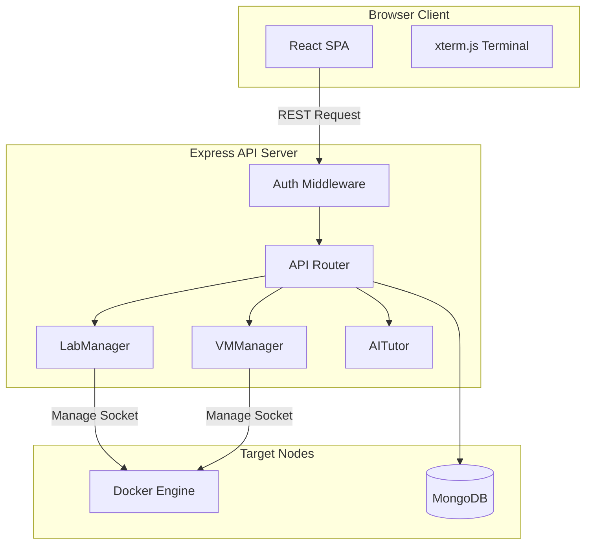

# EduSec Labs ⚡

[](https://github.com/Aryan7878/edusec-lab/actions)
[](https://opensource.org/licenses/MIT)
[](https://hub.docker.com/)
[](https://nodejs.org/)

EduSec Labs is an **AI-powered, browser-based cybersecurity learning platform** designed to provide hands-on security training inside isolated on-demand Docker labs. 

Students can spin up vulnerable targets, control preconfigured pentesting tools, and get hints from a Socratic AI coach—all from a single, clean web interface.

---

## 🚀 Key Features

*   **On-Demand Containerized Labs:** Launch targets like DVWA and OWASP Juice Shop in isolated environments with dedicated port allocation.
*   **Persistent Kali-Lite Workspace:** A browser-accessible Alpine pen-testing container pre-provisioned with standard utilities (`nmap`, `gobuster`, `hydra`, `john`, `sqlmap`, and the `rockyou` wordlist).
*   **Integrated Socratic AI Tutor:** A GPT-4o-mini-powered tutor that explains concepts, checks console errors, and guides you to solutions without giving away raw exploitation keys.
*   **Interactive Web Terminal:** Execute commands inside target containers directly from the web panel powered by `xterm.js`.
*   **Capture The Flag (CTF) Mode:** Solve realistic challenges, submit flags, accumulate points, and compete on the live leaderboard.
*   **Automatic Lifespans & Sweeper:** Protects server resources with automated 30-minute inactivity timeouts for labs and workspace containers.

---

## 📸 Screenshots

| Landing Portal | Student Dashboard |
| :---: | :---: |
|  |  |

| Vulnerability Lab Workstation | AI Cyber Coach |
| :---: | :---: |
|  |  |

---

## 🛠️ Architecture

EduSec Labs uses Express.js on the backend to interact directly with the host system's Docker socket via Node child processes, allocating ports dynamically and maintaining state tracking.



---

## 🧰 Tech Stack

*   **Frontend:** React (v18), Vite, Bootstrap (v5), xterm.js
*   **Backend:** Node.js, Express.js, JWT, bcryptjs, express-rate-limit
*   **Database:** MongoDB, Mongoose
*   **Infrastructure:** Docker, Docker Compose
*   **AI Engine:** OpenAI GPT-4o-mini API / Offline Local Knowledge Base

---

## ⚙️ Environment Variables

Copy the template configuration before startup:
```bash
cp .env.example backend/.env
```

| Variable | Description | Default |
|---|---|---|
| `NODE_ENV` | Application environment status (`development` or `production`) | `production` |
| `PORT` | Local host port of backend server | `5000` |
| `SERVE_STATIC` | Serve bundled static react page from backend server | `true` |
| `MONGODB_URI` | Connection URI for the MongoDB database | `mongodb://mongodb:27017/edusec-labs` |
| `JWT_SECRET` | Secret key used for signing authentication payloads | `change-this-to-a-secure-random-key` |
| `CORS_ORIGIN` | Allowed domains for cross-origin API headers | `*` |
| `LAB_TIMEOUT_MINUTES` | Minutes allowed before shutting down idle workspaces | `30` |
| `OPENAI_API_KEY` | Optional API key used for full Socratic AI Tutor capabilities | (offline KB fallback) |

---

## 🚦 Installation & Local Development

### Prerequisites
*   Node.js (v18 or higher)
*   MongoDB (v6.0 or cloud instance)
*   Docker Engine / Docker Desktop

### 1. Clone & Setup Workspace
```bash
git clone https://github.com/Aryan7878/edusec-lab.git
cd edusec-lab
```

### 2. Startup Backend Dev Server
```bash
cd backend
npm install
# Configure your local backend/.env
npm run init-labs
npm run init-challenges
npm run dev
```

### 3. Startup Frontend Dev Server
```bash
cd ../frontend
npm install
npm run dev
```
Open [http://localhost:5173](http://localhost:5173) in your browser.

---

## 🐳 Docker Deployment (Production)

We package the React production build directly inside the Node server using a multi-stage Docker build.

### Build and Run with Docker Compose
```bash
# Pull images and build the platform
docker compose -f docker-compose.prod.yml up -d --build

# Populate database structures (run once)
docker exec -it edusec-labs-app node scripts/initLabs.js
docker exec -it edusec-labs-app node scripts/initChallenges.js
```
The platform will be live at [http://localhost:5000](http://localhost:5000).

---

## 📂 Project Structure

```
edusec-labs/
├── .github/workflows/          # CI/CD pipelines
├── backend/
│   ├── models/                 # Database schemas
│   ├── routes/                 # REST controllers
│   ├── services/               # Container & VM lifecycle services
│   └── server.js               # Express app core
├── docs/                       # Technical specs & openapi schemas
├── frontend/
│   ├── src/
│   │   ├── components/         # Dashboard, Terminal, AI Coach panels
│   │   └── contexts/           # JWT and Global Alert hooks
│   └── vite.config.js          # Port forwarding & builds
└── docker-compose.prod.yml     # Standalone Docker compose setup
```

---

## 🛡️ Security Features
*   **Container Isolation:** Per-user namespaced sandboxes prevent container crossover.
*   **Inactivity Reaping:** Inactivity timers stop orphaned containers.
*   **Brute-Force Protection:** Rate limiting applied to sensitive endpoints (flag submissions).
*   **Clean Credential Storage:** Salted SHA-256 password storage via bcrypt.

---

## 🗺️ Roadmap
*   **Phase 1 (Core Engine):** SQLite fallback database option, strict memory limits on user nodes.
*   **Phase 2 (Gamification):** Skill Tree modules, achievements, custom badges.
*   **Phase 3 (Blue Team Labs):** Syslog analysis, ELK monitoring inside containers.
*   **Phase 4 (Autoscaling):** Kubernetes helm deployment specifications.

---

## 🤝 Contributing

We welcome community contributions! Please read our [CONTRIBUTING.md](CONTRIBUTING.md) guide for details on branching structures, local setup steps, and formatting standards.

---

## 📄 License

This project is licensed under the MIT License. See [LICENSE](LICENSE) for details.
