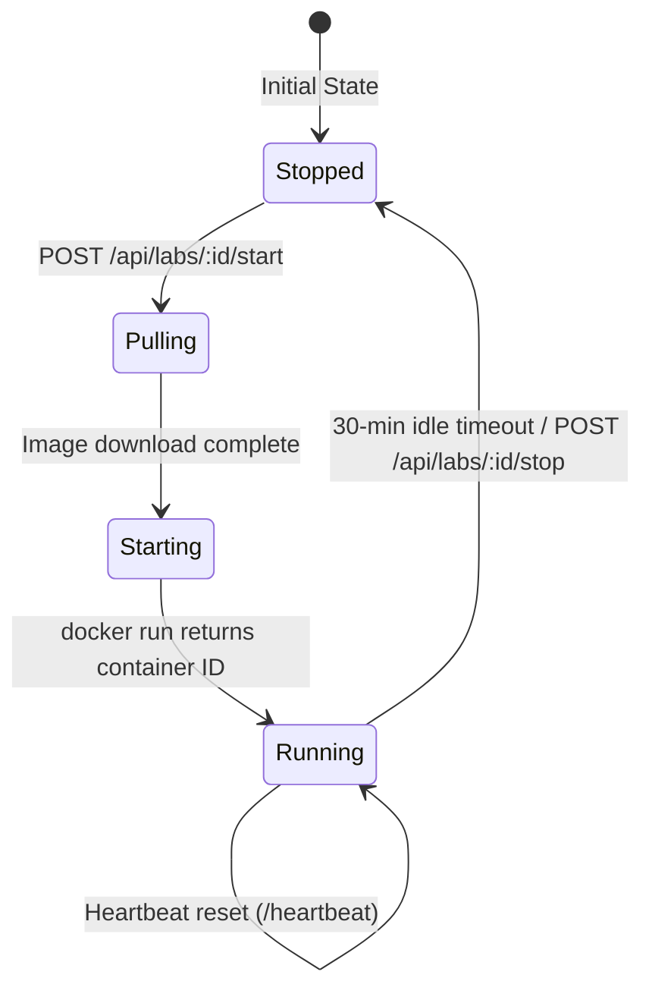

# Docker Integration Architecture — EduSec Labs

This document details the Docker orchestration engine built into EduSec Labs. It explains how the Node.js backend handles dynamic container creation, networking, security policies, and inactivity sweeping.

---

## 1. Daemon Interaction Model

The Node.js server controls the host's Docker engine by communicating directly with the Docker Unix socket (`/var/run/docker.sock`). 

```
┌─────────────────────────┐
│ Express Server (NodeJS) │
└────────────┬────────────┘
             │
     child_process.exec (Sends raw command strings to Docker CLI)
             │
             ▼
    /var/run/docker.sock
             │
             ▼
     ┌───────────────┐
     │ Docker Engine │
     └───────────────┘
```

In a production environment (when running inside a containerized setup using `docker-compose.prod.yml`), the host's Docker socket is mapped into the application container:
```yaml
volumes:
  - /var/run/docker.sock:/var/run/docker.sock
```
The Docker CLI binary must be installed inside the backend image for these shell instructions to execute successfully.

---

## 2. Lab Container Lifecycles

Every sandbox target uses a strict lifecycle managed by `backend/services/labManager.js`:



### Allocation Pipeline:
1.  **Port Probing:** The engine scans active container listings starting at port `8082`. It picks a random offset up to `1000` to prevent users from scanning sequential ports of other students.
2.  **Container Naming:** Containers are namespaced to avoid collision:
    ```
    edusec_lab_{labId}_{userId}
    ```
3.  **Clean Startup:** If a container with the same name exists, the engine runs `docker rm -f` to clear stale resources before starting a fresh container.
4.  **Runtime Execution:** Standard images run without auto-restart policies (`--restart=no`) to ensure abandoned targets do not restart upon server reboot.

---

## 3. Sandboxing & Isolation

### Current Level of Isolation
*   **Namespacing:** Dynamic port binding separates user routing entry points. Users can only execute shell commands in containers matching their specific `userId` namespace.
*   **Data Isolation:** Databases are isolated. Progress records are partitioned per user ID in MongoDB.

### Security Concerns & Mitigations (Roadmap)
*   **Root Vulnerability:** Currently, lab processes run as root inside their respective container environments. Malicious users could execute kernel exploits or break container barriers. 
    *   *Remediation:* Migrate base images to rootless configurations or use gVisor runtimes.
*   **Command Injection:** The terminal executes commands inside the containers via `docker exec`. Raw strings are passed directly to `/bin/sh`.
    *   *Remediation:* Limit character lists or migrate to standard WebSocket channels feeding directly into shell PTY streams.

---

## 4. Inactivity Reaping (Sweeper)

To prevent resource leaks on host machines, `LabManager` tracks the `lastActivityAt` timestamp for each active user sandbox.

```javascript
touchActivity(userId, labId) {
  const key = `${userId}:${labId}`;
  const info = this.activeLabs.get(key);
  if (!info) return false;
  info.lastActivityAt = new Date();
  return true;
}
```

*   **Heartbeat Loop:** While a student views the lab, the frontend pings `/api/labs/:id/heartbeat` every 3 minutes.
*   **Activity Touchpoints:** Any command executed via the interactive terminal automatically updates the `lastActivityAt` timestamp.
*   **Sweeper Daemon:** A background loop runs every 5 minutes in the backend, scanning maps for sessions that have been inactive for more than 30 minutes, and calling `docker rm -f` on expired sandboxes.

---

## 5. Troubleshooting Commands

If containers fail to orchestrate or start properly, run the following diagnostic commands on the host machine:

### Check Backend Logs
```bash
docker compose -f docker-compose.prod.yml logs -f app
```

### Inspect Stale Containers
```bash
docker ps -a --filter "name=edusec_lab_"
```

### Force Delete Orphan Containers
```bash
docker rm -f $(docker ps -a -q --filter "name=edusec_lab_")
```

### Clean System Cache (Prune unused lab images)
```bash
docker image prune -a --filter "until=24h"
```
